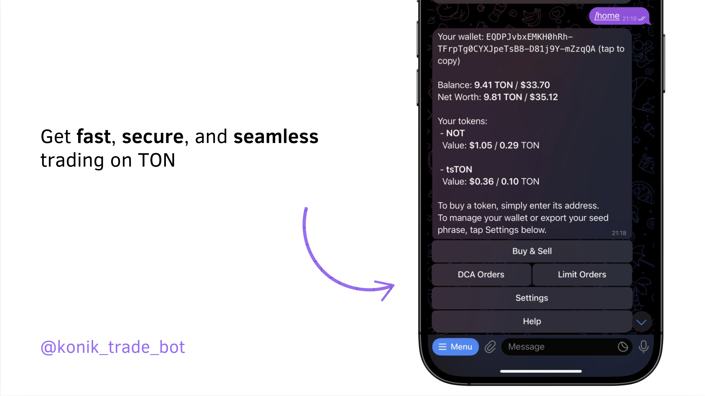

# Konik Trade Bot

An open source repository for Konik Trade Bot maintained by [Blackbot](https://blackbot.technology/).  
Konik Trade Bot - the fastest and most secure way to trade any token on TON.



### Interfaces

- TWA: [@konik_trade_bot](https://t.me/konik_trade_bot)

### Socials / Contact

- Telegram Channel: [@konik_trade](https://t.me/konik_trade)
- Community Chat: [@konik_trade_chat](https://t.me/konik_trade_chat)
- Email: [info.blackbot@gmail.com](mailto:info.blackbot@gmail.com)

# Development info

### Getting Started

1. Clone repository
```
git clone https://github.com/0xblackbot/konik-trade-bot.git && cd konik-trade-bot
```

2. Install dependencies
```
yarn
```

3. Start the development server
```
yarn start
```

If you want to contribute your code, before making a pull request - ensure, that code passes all pipeline checks. You can manually check it before a pull request running commands
```
yarn ts
yarn lint
```

### License

This project is licensed under the Apache License 2.0 - see the [LICENSE](LICENSE) file for details.
